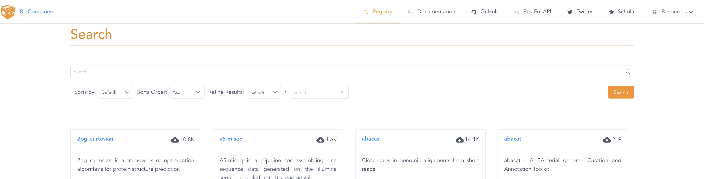
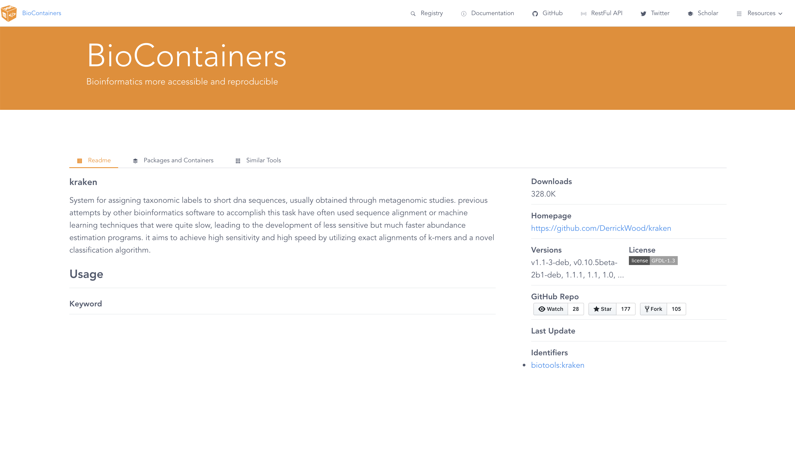
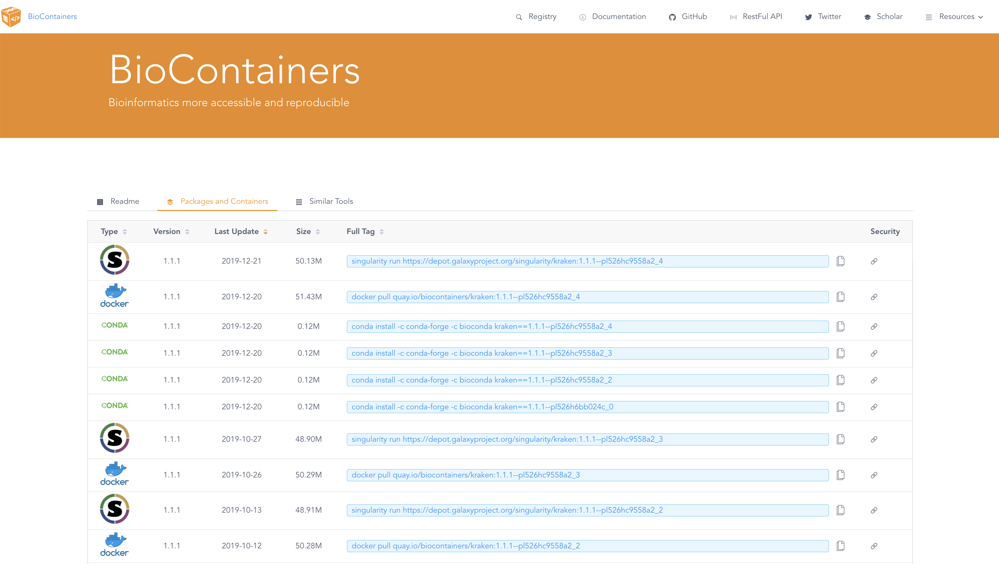

# How to add new BioContainers to META system
META has been designed to increase interoperability between metagenomic classifiers by providing a modular template for integration. This is done via a standard META [YAML](https://yaml.org/) description in `biocontainers.yaml`. See [Section III](#iii-populate-biocontainersyaml) for more details about `biocontainers.yaml`.

To add a new classifier to META, you will need to complete four steps:

## I. Search BioContainer in registry.
[BioContainers](https://biocontainers.pro/#/) are [Docker](https://www.docker.com/) containerized version of the most commonly used metagenomic classifiers to provide consistent deployment. _REQUIREMENT_: To be integrated into META system, the tool _must_ be available in the BioContainers registry. 

In the search bar, search for the desired tool and select the corresponding card.


You will be directed to a description of the tool. Click the __Packages and Containers__ tab, to show the available pre-built containers.


Sort the containers by __Last Updated__ and look for the _most recent Docker_ container. 


__NOTE__: the image tag of the chosen container. This is the alpha-numeric path following `docker pull`. For example, the image tag for `docker pull quay.io/biocontainers/kraken:1.1.1--pl526hc9558a2_4` is `quay.io/biocontainers/kraken:1.1.1--pl526hc9558a2_4`.

## II. Identify tool-specific commands

It is necessary to identify tool-specific commands that execute four stages of metagenomic classifiers: **download**, **build**, **classify**, and **report**. These stages were identified based on observations regarding usage of the metagenomic tools selected for integration in the META system. The following assumptions are made about all tools seeking integration with META: 
* It is expected that the tool database relies on a set of reference nucleotide or protein sequences.
* It is expected that the tool can perform an analysis that provides the percent abundance of organisms present in a given sequence (`*.fastq` or `*.fasta`) with respect to its database. This percent abundance of organisms is called an *abundance profile*.
* It is expected that the tool can report this abundance profile explicitly or its abundance profile can be derived from tool output products.

This has led to the following associations within the META ecosystem:
* **download**: Command provided by the tool that downloads the set of reference nucleotide or protein sequences. Depending on the use case, the set of reference sequences may already be present on the host machine. This is likely the case for those seeking to build custom reference databases. However, it is encouraged to include the relevant "download" commands to construct the default database, if applicable. An example of this is `kraken-build --db kraken_db --download-taxonomy`. Currently, this command is *not* automatically executed within the META system. See [following](#build-classifier-database) subsection for details.
* **build**: Command provided by the tool that builds the database indices and relevant files from the set of downloaded reference sequences. This may consist of multiple commands and/or file manipulations such as `mv` (move) or `cp` (copy). This is compatible with the META system, provided some constraints noted in [Section III](#iii-populate-biocontainersyaml). An example of this is `kraken-build --db kraken_db --build`. Currently, this command is *not* automatically executed within the META system. See [following](#build-classifier-database) subsection for details.
* **classify**: Command provided by the tool that runs a classification analysis. Some examples of classification analysis include classification via distance metric, string comparison, or EM-algorithm. The command ideally contains an argument that specifics an output directory or output file path. An example of this is `kraken --db $db --output $output $input`. In the case that this is not available, additionally commands should include a) moving the default output to the META report filepath, or b) writing the standard output to a META report filepath. The META report filepath is discussed in [Section III/Variables in tool commands/{{VAR_REPORT_FILEPATH}}](#var_report_filepath). 
* **report**: Command provided by the tool that formats the tool outputs to a specific format, if applicable. An example of this is `kraken-report --db $db $output`. An additional command may be necessary to rename the formatted report to `<tool_name>.report`. Some tools may not bundle a reporting utility, in which case, the META report file will be generated in the **classify** stage and no **report** command needs to be identified. 

Notice that a set of installation commands are *not* required. This highlights the advantage of using BioContainer Docker images for deployment, as it does not require end users to install the tool and its dependencies prior to using it.

### Build classifier database
The reference database for a given tool must be built prior to running the classifier within the META system. Use the above **download** and **build** commands to build the database. It is recommended that the name of the directory containing the database is `<tool_name>_db`. For example, the name of the database directory for the Kraken tool can be named `kraken_db`. 

**REQUIREMENT**: This directory *must* be located within the directory specified by the value of `BIOCONTAINER_DB_DIR` in `meta_system/shared/config.py`.

## III. Populate `biocontainers.yaml`

Four conceptual stages of metagenomic classifier usage have been identified and described in [Section II](#ii-identify-tool-specific-commands). Not all tools may adhere to this structure, however, from our research, these are sufficient for handling most tools. The commands identified in [Section II](#ii-identify-tool-specific-commands) will be used to populate the `biocontainers.yaml` file found in the top-level directory of `meta_system`. 

Every entry in the YAML file, has the following format. A description of each attribute is included in the YAML comments. 

```yaml
kraken:
  image: quay.io/biocontainers/kraken:1.1.1--pl526hc9558a2_4 # Docker image tag
  link: http://ccb.jhu.edu/software/kraken/MANUAL.html # url for tool reference
  database_name: kraken_db # top-level directory name of database relative to config.BIOCONTAINER_DB_DIR
  file_formats: # list (denoted by -) of file formats of sequence data
    - fasta
    - fastq
  download: # list of commands needed to download the reference files
    - kraken-build --db {{VAR_CONTAINER_DB}} --download-taxonomy
    - kraken-build --db {{VAR_CONTAINER_DB}} --download-library archaea --download-library bacteria --download-library viral --use-wget
  build: # list of commands needed to build the classifier database
    - kraken-build --db {{VAR_CONTAINER_DB}} --build
  classify: # list of commands needed to run classification
    - kraken --db {{VAR_CONTAINER_DB}} --output {{VAR_RESULT_FILEPATH}} {{VAR_SEQUENCE_FILEPATH}}
  report: # list of commands needed to run reporting
    - kraken-report --db {{VAR_CONTAINER_DB}} {{VAR_RESULT_FILEPATH}}
```

After a new entry has been added to `biocontainers.yaml`, download the Docker image by running `make pull-containers` from the top-level directory, `meta_system`.

### Variables in tool commands
Variables can be injected into commands at every stage using a META-specific syntax within the YAML file. Variables are surrounded by `{{ }}`. The variable value will be replaced in place of the brackets and variable name during execution time. The available variables include:
The variable replacement occurs in `parse_container_command()` in `system/utils/biocontainers.py`.

#### `{{VAR_CONTAINER_DB}}`
Path to database from within Docker container, typically `/db/<database_name>`

#### `{{VAR_RESULT_FILEPATH}}` 
Path to raw output relative to the BioContainer Docker environment, typically `/data/<tool>.result`. To find the META result file _outside_ the Docker container, navigate to `meta_system/data/jobs/<user_job_id>/<read_type>/<tool_name>/<tool_name>.result` (for simulation + classification) or `meta_system/data/jobs/<user_job_id>/<tool_name>/<tool_name>.result` (for classification) on the host machine.
* If the raw output presents the necessary information for evaluation, use `{{VAR_REPORT_FILEPATH}}` instead. See next variable for more details.

#### `{{VAR_REPORT_FILEPATH}}`  
Path to formatted report within to the BioContainer Docker environment (typically `/data/<tool>.report`), if provided by classifier. The report file __must__ be present, in order, for evaluation metrics to be computed. Therefore, the `{{VAR_REPORT_FILEPATH}}` must exist in at least one command at any stage. To find the META report file _outside_ file outside the BioContainer, navigate to `meta_system/data/jobs/<user_job_id>/<read_type>/<tool_name>/<tool_name>.report` (for simulation + classification) or `meta_system/data/jobs/<user_job_id>/<tool_name>/<tool_name>.report` (for classification) on the host machine.

#### `{{VAR_SEQUENCE_FILEPATH}}` 
Path to input sequence file within Docker container (typically `/data/input.fastq`).
 
#### `{{VAR_GENOMIC_FNA_FILEPATH}}`  
Path to nucleic acid FASTA (.fna) file needed to populate classifier database from within Docker container.

#### `{{VAR_PROTEIN_FAA_FILEPATH}}`  
Path to protein acid FASTA (.faa) file needed to populate protein classifier database from within Docker container.

### Execution environment of commands
The commands corresponding to each stage are run within the Docker container specified by the `image` tag. Each command in the list is run using:

```shell
docker run -v /path/to/db:/db -v /path/to/mounted/files:/data image_tag command
```

This is important to consider prior to populating this commands, as each `docker run ... ` starts a fresh shell. Any environment variables, temporary files, etc that are generated in the previous commands will _not_ be available in the subsequent command unless specifically written out to a mounted volume. 

### Omitting stages
Additionally, for stages that must be omitted, you __must still__ include the corresponding YAML key, but you may leave the list blank. For example, see the `report` key in the following YAML,
``` yaml
krakenuniq:
  image: quay.io/biocontainers/krakenuniq:0.5.8--pl526he513fc3_3
  link: https://github.com/fbreitwieser/krakenuniq
  database_name: krakenuniq_db
  file_formats:
    - fastq
  download:
    - krakenuniq-download --db {{VAR_CONTAINER_DB}} taxonomy
    - krakenuniq-download --db {{VAR_CONTAINER_DB}}  --threads 24 refseq/bacteria refseq/archaea
  build:
    - krakenuniq-build --db {{VAR_CONTAINER_DB}}
  classify:
    - krakenuniq --db {{VAR_CONTAINER_DB}} --threads 10 --fastq-input {{VAR_SEQUENCE_FILEPATH}} --output {{VAR_RESULT_FILEPATH}} --report-file {{VAR_REPORT_FILEPATH}}
  report:
```

## IV. Add parser for taxonomic results

### Parser Requirements
A custom parser needs to be written such that it translates the classifier output to a META standard output, `results/parsed_<tool_name>`. An excerpt example of the META TSV is shown below, where the columns represent all reported leaf taxonomic ID and abundance proportions, respectively (left, right):

```tsv
79329   0.000784929
366602  0.003924647
1936081 0.000784929
64187   0.009419152
562     0.003139717
573     0.004709576
2293838 0.003139717
78219   0.067503925
307467  0.003139717
1962501 0.007849294
...
```

The right column should sum to 1.

The input file for the parser should contain leaf taxonomic ID and abundance proportions, or contain information such that derivatives satisfy the above output TSV. 
Example parsers written in Bash can be found in `meta_system/system/metrics/evaluation/parsers`. 

**REQUIREMENT**: Currently, the META system requires that all parsers be written as a Bash shell script.

### Add to META system
After a parser is written, place the parser file in `meta_system/system/metrics/evaluation/parsers` and then run `make build-evaluation` from the top-level directory, `meta_system`, to ensure that the new parse will run as an executable.
