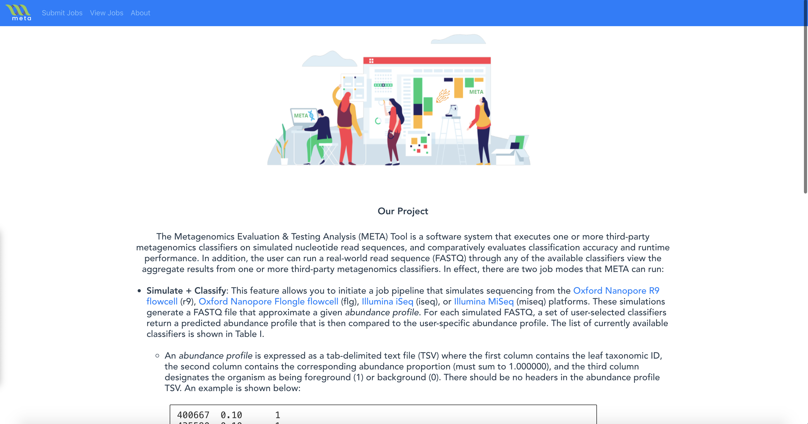
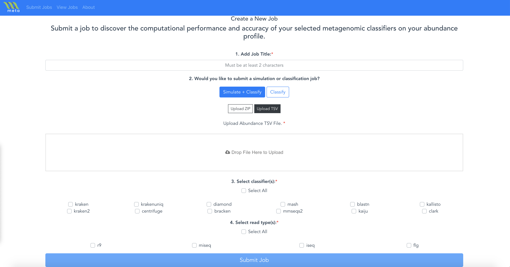

# Metagenomics Evaluation & Testing Analysis (META) Tool

The Metagenomics Evaluation & Testing Analysis (META) Tool is a software system that executes one or more third-party metagenomics classifiers on simulated nucleotide read sequences, and comparatively evaluates classification accuracy and runtime performance. In addition, the user can run a real-world read sequence (FASTQ) through any of the available classifiers view the aggregate results from one or more third-party metagenomics classifiers. 

## Summary

  - [Getting Started](#getting-started)
  - [How to Use](#using)
  - [Running the tests](#running-the-tests)
  - [Development](#development)
  - [Contributing](#contributing)
  - [Roadmap](#roadmap)
  - [Versioning](#versioning)
  - [License](#license)

## Getting Started

These instructions will get you a copy of the project up and running on
your local machine for development and testing purposes. 

### Prerequisites
The META system has been designed to run on Linux (specifically, tested on Ubuntu 18.04) and in Docker containers. 
The following packages are required:
* [Make](https://www.gnu.org/software/make/)
* [Docker-ce 19.03](https://docs.docker.com/engine/)
* [Docker-compose](https://docs.docker.com/compose/)
        
Here is an example of how to install these on Ubuntu 18.04:
```bash
# Install Make
sudo apt-get update
sudo apt-get install build-essential
dpkg -l | grep automake  # to verify successful install

# Install Docker engine (reference: https://docs.docker.com/engine/install/ubuntu/)
sudo apt-get remove docker docker-engine docker.io containerd runc
sudo apt-get update
sudo apt-get install \
    apt-transport-https \
    ca-certificates \
    curl \
    gnupg-agent \
    software-properties-common
curl -fsSL https://download.docker.com/linux/ubuntu/gpg | sudo apt-key add -
sudo add-apt-repository \
    "deb [arch=amd64] https://download.docker.com/linux/ubuntu \
    $(lsb_release -cs) \
    stable"
sudo apt-get update
sudo apt-get install docker-ce docker-ce-cli containerd.io
sudo docker run hello-world # to verify successful install

# Install Docker-compose (reference: https://docs.docker.com/compose/install/)
sudo curl -L "https://github.com/docker/compose/releases/download/1.26.2/docker-compose-$(uname -s)-$(uname -m)" -o /usr/local/bin/docker-compose
sudo chmod +x /usr/local/bin/docker-compose
docker-compose --version  # to verify successful install
```

### Configuring

Prior to starting up META, you need to update your configurations for the:
* Locations of your metagenomic reference databases (**default**: `"/srv/databases"`)
* MongoDB database port (**default**: `27017`)
* META server host bind (**default**: `"127.0.0.1"`) and port (**default**: `5000`)
* Docker-in-Docker DNS Server for internet access (**default**: `"--dns 8.8.8.8"`)

To change these configuratons, go to the `docker-compose.yaml` file and update the following:
```yaml
# Configure location of metagenomic reference databases
services:
  # ...
  meta_docker:
  # ...
    volumes:
      - ./data:/data
      - <INSERT_PATH_HERE>:/srv/databases  # only modify left-hand side where <INSERT_PATH_HERE>
      - meta_docker_data:/var/lib/docker
      - meta_docker_certs_ca:/certs/ca
      - meta_docker_certs_client:/certs/client
  # ...
    command: "--dns 8.8.8.8"  # modify IP addresses to match your enterprise's DNS servers
  # ...
  meta_system:
    volumes:
      - ./data:/data
      - <INSERT_PATH_HERE>:/srv/databases  # only modify left-hand side where <INSERT_PATH_HERE>
      - meta_docker_certs_client:/certs/client:ro
```
```yaml
# Configure MongoDB database port
services:
  mongodb:
    # ...
    ports:
      - "127.0.0.1:<INSERT_PORT_HERE>:27017"  # only modify left-hand side where <INSERT_PORT_HERE>
```
```yaml
# Configure META server host bind and port
services:
  # ...
  meta_system:
    # ...
    ports:
      - "<INSERT_SERVER_HOST_BIND_HERE>:<INSERT_SERVER_PORT_HERE>:5000"  # only modify left-hand side where <INSERT_SERVER_HOST_BIND_HERE> and <INSERT_SERVER_PORT_HERE>
```

### Build META Simulator
If you do not have the [META Simulator](https://github.com/JHUAPL/meta-simulator) Docker image on your machine, you will need to do the following steps:
1. Clone META Simulator from https://github.com/JHUAPL/meta-simulator
2. From the `meta-simulator` directory, run: 
    ```bash
    docker build -t meta_simulator:latest .
    docker save -o meta_simulator.tar meta_simulator:latest
    ```
3. Copy the `meta_simulator.tar` to `meta_system/data/docker`
4. Run `make load-docker` from the `meta_system` directory

### Installing

META uses `make` to handle building and install META system.

To deploy using Docker, run:
  ```bash
  make build-docker
  make up-docker
  make logs-docker  # to verify successful install (see below)
  ```

You can verify your application is running successfully by checking that the following logs are visible in your terminal window:
```bash
2020-07-23 19:19:17,976      shared.log INFO     LOGGING INITIALIZED
2020-07-23 19:19:18,034      shared.log DEBUG    STARTING JOB QUEUE WATCHDOG
  * Serving Flask app "system" (lazy loading)
  * Environment: production
    WARNING: This is a development server. Do not use it in a production deployment.
    Use a production WSGI server instead.
  * Debug mode: on
  * Running on http://0.0.0.0:5000/ (Press CTRL+C to quit)
  * Restarting with stat
2020-07-23 19:19:18,606      shared.log INFO     LOGGING INITIALIZED
2020-07-23 19:19:18,656      shared.log DEBUG    STARTING JOB QUEUE WATCHDOG
  * Debugger is active!
  * Debugger PIN: 219-671-456
2020-07-23 19:19:19,036      shared.log INFO     WAITING FOR NEW JOBS...
```

### Using
To begin using META, navigate to `http://localhost:5000`. You should see the following page in your web browser:
    

In effect, there are two job modes that META can run:
* **Simulate + Classify**: This feature allows you to initiate a job pipeline that simulates sequencing from the [Oxford Nanopore R9 flowcell](https://store.nanoporetech.com/us/flowcells/spoton-flow-cell-mk-i-r9-4.html) (`r9`), [Oxford Nanopore Flongle flowcell](https://nanoporetech.com/products/flongle) (`flg`), [Illumina iSeq](https://www.illumina.com/systems/sequencing-platforms/iseq.html) (`iseq`), or [Illumina MiSeq](https://www.illumina.com/systems/sequencing-platforms/miseq.html) (`miseq`) platforms. These simulations generate a FASTQ file that approximate a given *abundance profile*. For each simulated FASTQ, a set of user-selected classifiers return a predicted abundance profile that is then compared to the user-specific abundance profile. The list of currently available classifiers is shown in the table below.
    * An *abundance profile* is expressed as a tab-delimited text file (TSV) where the first column contains the leaf taxonomic ID, the second column contains the corresponding abundance proportion (must sum to 1.000000), and the third column designates the organism as being foreground (`1`) or background (`0`). There should be no headers in the abundance profile TSV. An example is shown below:
        ```TSV
        400667	0.10	1
        435590	0.10	1
        367928	0.10	1
        864803	0.10	1
        1091045	0.10	1
        349101	0.10	1
        1282	0.10	1
        260799	0.10	1
        1529886	0.10	1
        198094	0.10	1
        ```
* **Classify**: This feature allows you to initiate a job pipeline that accepts a FASTQ file and runs a set of user-selected classifiers. The list of currently available classifiers is shown below.
The metagenomic classifiers currently integrated in META include:

| Tool | Description | Average Runtime (seconds) for 1.0 GB FASTQ File |
| ----- | ----- | ----- |
| [Kraken](http://ccb.jhu.edu/software/kraken/MANUAL.html) | k-mer based, exact alignment | 4.95 |
| [Kraken2](https://github.com/DerrickWood/kraken2/blob/master/docs/MANUAL.markdown) | k-mer based, exact alignment, with smaller memory requirements, and translated search mode | 0.32 |
| [KrakenUniq](https://github.com/fbreitwieser/krakenuniq) | k-mer based, exact alignment with smaller memory requirements | 71.05 |
| [Bracken](https://github.com/jenniferlu717/Bracken) | k-mer based abundance estimation from raw reads | 0.04 |
| [Centrifuge](https://github.com/infphilo/centrifuge/blob/master/MANUAL.markdown) | alignment based on BWT and FM-indexing schemes | 14.38 |
| [DIAMOND](http://www.diamondsearch.org/index.php) | alignment based, SW against protein database | 145.47 |
| [Mash](https://mash.readthedocs.io/en/latest/) | k-mer based, locality sensitive hashing | 0.64 |
| [MMseqs2](https://github.com/soedinglab/mmseqs2) | k-mer based | 0.07 |
| [BLASTN/P](https://github.com/chenying2016/queries/tree/master/hs-blastn-src) | alignment based, basic local alignment | 74.08 |
| [Kaiju](https://github.com/bioinformatics-centre/kaiju) | alignment based on BWT and FM-indexing schemes using protein sequences | 14.63 |
| [Kallisto](https://pachterlab.github.io/kallisto/manual) | alignment based, pseudoalignment procedure | 0.05 |
| [CLARK](http://clark.cs.ucr.edu/Overview/) | k-mer based species or genus level classification | 0.04 |

It is possible to add new classifiers to META by following the instructions in [ADD_BIOCONTAINERS.md](ADD_BIOCONTAINERS.md).

#### Step-by-step 
1. Click the **Submit Jobs** button in the Navigation Bar.
2. Configure the job with
    - the Job Title
    - the mode you would like to use **Simulate + Classify** or **Classify**
    - upload an abundance profile TSV file *or* a FASTQ file 
        - A sample abundance profile is included in `meta_system/data/sample_abundance_profile.tsv`
            - To start *Simulate + Classify* jobs in bulk, you may submit a `.zip` folder of abundance profiles (i.e. a
              zipped folder of `.tsv` files). You will be provided the option to **Upload ZIP** after selecting 
              **Simulate + Classify**. This will create a new row in the *View Jobs* table for each `.tsv` file contained in
              the ZIP folder. It is recommended that the TSV files in the folder are uniquely named.
        - A sample FASTQ file is included in `meta_system/data/fastq/sample.fastq`
            - To start *Classify* jobs in bulk, you may submit a `.zip` folder of abundance profiles (i.e. a
              zipped folder of `.fastq` files). You will be provided the option to **Upload ZIP** after selecting 
              **Classify**. This will create a new row in the *View Jobs* table for each `.fastq` file contained
              in the ZIP folder. It is recommended that the FASTQ files in the folder are uniquely named.
    - the classifiers you would like to use
    - the simulation read type, *if you selected the **Simulated + Classify** mode*

3. Click **Submit Job**

## Development

### Pre-requisites
If you would like to install a **development version** (outside of Docker), the following _additional_ packages are required:
* [Parallel](https://www.gnu.org/software/parallel/)
* [Python 3.7+](https://www.python.org/)
* [Node 10+ (v10.19.0)](https://nodejs.org/en/blog/release/v10.0.0/)
* [Node Package Manager 6+ (6.14.2)](https://www.npmjs.com/)

Here is an example of how to install these on Ubuntu 18.04:
```bash
# Install Parallel
sudo apt-get install parallel
dpkg -l | grep parallel  # to verify successful install

# Install Python 3.7+ (reference: https://linuxize.com/post/how-to-install-python-3-7-on-ubuntu-18-04/)
sudo apt update
sudo apt install software-properties-common
sudo add-apt-repository ppa:deadsnakes/ppa
sudo apt install python3.7
python3 --version  # to verify successful install

# Install Node 10+ (reference: https://joshtronic.com/2018/05/08/how-to-install-nodejs-10-on-ubuntu-1804-lts/)
sudo apt install curl
curl -sL https://deb.nodesource.com/setup_10.x | sudo -E bash -
sudo apt install nodejs
node --version  # to verify successful install

# Install Node Package Manager (NPM)
sudo apt install npm
npm --version  # to verify successful install
```

### Configuring
Prior to starting up META, you need to update your configurations for the:
* META server host bind (**default**: `"0.0.0.0"`) and port (**default**: `5000`)
* Locations of your metagenomic reference databases (**default**: `""`)
* MongoDB database port (**default**: `27018`)


To change these configuratons, go to the `meta_system/shared/config.py` file and update the following:
```python
class MetaConfiguration(BaseSettings):
  # ...
  
  # Modify META server host bind and port
  SERVER_BIND: str = "0.0.0.0"  # <-- Modify server host bind here
  SERVER_PORT: str = 5000  # <-- Modify port number here
  
  # ...

  # Configure Biocontainers info and database paths
  # ...
  BIOCONTAINER_DB_DIR: str = ""  # <--- Modify location of metagenomic reference databases
  
  # ...

  # Configure MongoDB
  # ...
  MONGO_PORT: int = 27017  # <-- Modify MongoDB port here

```

### Installing

To deploy a development server, run:
  ```bash
  make build
  make up-db
  make up
  ```

## Contributing

Please read [CONTRIBUTING.md](CONTRIBUTING.md) for details on our code
of conduct, and the process for submitting pull requests to us.

## Roadmap

Here are some planned improvements, in no particular order:
* Add ability to compare between select job results
* Add prediction model to determine the runtime of a job prior to executing
* Add metagenomic assemblers
* Add configurable read counts for simulated reads
* Add configurable thread counts for metagenomic classifiers
* Add export capability for graphs and visualizations as PNG, JPEG, PDF, etc.
* Add ability to construct abundance profile for simulation within the user interface
* Add user management

## Versioning

We use [SemVer](http://semver.org/) for versioning. For the versions
available, see the [tags on this
repository](https://github.com/JHUAPL/meta-system/tags).

## License

This project is licensed under [Apache 2.0](http://www.apache.org/licenses/LICENSE-2.0).
Copyright under Johns Hopkins University Applied Physics Laboratory.
